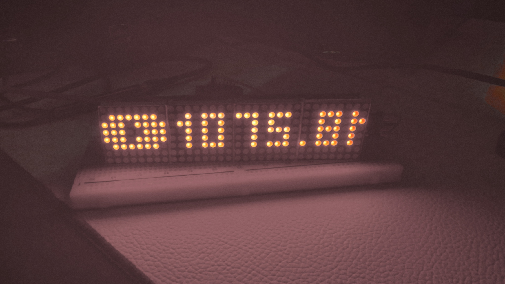

# Wemos D1 mini Youtube Subscribe counter

inspired by: [The Swedish Maker Video](https://www.youtube.com/watch?v=CmitRp17UGI&t=204s)


> In `./case_files` you will find graphic and 3D model for the case if you are intrested


### Is a small script which will allow `Wemos D1 mini` to retrieve data from `YOUTUBE` and display it on `max7219` Matrix.

## Things you need to install:

* [Arduino IDE](https://www.arduino.cc/en/software)


## Credential file
 because of security all needed credentials are excluded from the repository. so you need to create a specific file as follows:
 * Create a file in the root directory with the name of `credentials.h`
 * Inside that file add these lines:
    ```c++
      #define API_KEY "YOUR_API_KEY"  //Your Youtube API-Key
      #define CHANNEL_ID "YOUR_ID"   // Your youtube channel ID

      const char* ssid = "YOUR_WIFI_NAME";           // SSID of local network
      const char* password = "YOUR_WIFI_PASSWORD";  // Password on network
    ```
## Arduino Setup `Wemos D1 mini`:

* Open Arduino
* go to `File > Preferences`
* add `http://arduino.esp8266.com/stable/package_esp8266com_index.json` in `Additional board manager URLs`
* go to `Sketch > Include Library > Manage libraries`
  on the left a menu will open in the `search bar` search in install:
    * MD Parola
    * MD_MAX72xx
    * ArduinoJson
    * YoutubeApi

* go to `Tools > port` select the port which `Wemos D1 mini` is connected
* select `Tools > Board > esp8266 > Generic ESP8266 Module`


## Pin Map

|Wemos D1 mini|MAX7219|
|-------------|-------|
|3.3V|VCC|
|G|GND|
|D8|DIN|
|D7|CS|
|D6|CLK|




# All contributions are welcome just make a PR 😃
